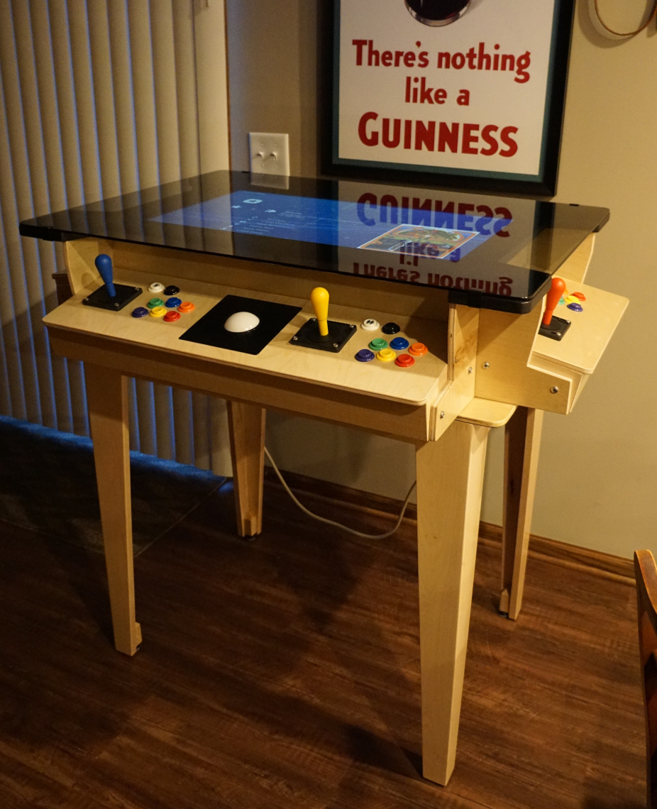

# Arcade Cocktail Table

Design of a custom standing 4 person arcade cocktail table.

## Motivation

One of the pastimes that I enjoyed thoroughly growing up was playing games at
the local arcade with my friends.  Recalling back to the sounds and graphics of
dozens and dozens of arcade cabinets playing at once, along with the friendly
competition to get that high score and bragging rights brings back fond
memories.

When my wife mentioned that she would love to have a cabinet with a trackball
to be able to play her favorite game centipede, I took on the project of
building an arcade cabinet as a Christmas present.  As with a number of my
ongoing projects I underestimated the time, energy, and cost involved in this!
In the end though our family is pretty happy with it.

## Design Goals

* Cocktail table format.
* Glass top.  Protect the display with a grey tinted glass top and allow
  players to set a beverage on it if desired without worrying about stains or
  damage.
* Multiple players.  Ideally allow up to 4 players to compete simultaneously.
* Modular.  Provide ability for control panels to be removed, debugged and
  replaced.

## CAD / Drawings

CAD was an invaluable tool to be able to design this up front and check the
format and aesthetics prior to building.  I used an open source CAD program
called [solvespace](https://solvespace.com), which I highly recommend if anyone
is looking for something like this.  There was a little bit of a learning curve
initially, but I feel quite comfortable and productive using it now at this
stage.  In addition I did this on my Lenovo x230 laptop/monitor combo which I
love but I'm sure many would consider quite old and outdated.  With that said
Solvespace has proven to be quite fast and usable on this laptop.

The CAD files can be obtained by downloading a zip or tarball from the
[releases](https://git.lenzplace.org/lenzj/arcade-cocktail-table/releases)
page, or alternately you can clone this repository using git.  The drawings
folder contains the files which all end in the ".slvs" filename extension used
by solvespace.  The main file for the fully assembled cabinet is titled
"cabinet-assembly.slvs".  The other files are all the various sub assemblies
and parts for the cabinet.  There are also some files that start with "cutlist"
that I created when planning how to efficiently cut out the various panels and
determine the number of sheets of plywood I would need etc.

Lastly there are also pdf and png sub folders in there which are derived
directly from the solid models.  The pdf folder in particular has dimensioned
2D drawings of the various parts of the cabinet.  Below are a couple examples
from the pdf files.  This is one area where solvespace is adequate (dimensioned
drawings), but there is room for improvement.  The solid modeling and
interactive design in contrast is top notch in my opinion.  Overall a very good
piece of free open source software though!

## Bill of Materials (BOM)

The repository also contains a bill of materials titled "BOM.ods", which is a
spreadsheet file created with LibreOffice.  As much as possible I tried to
include the brand and model number of the part along with the supplier that I
purchased it from as this was something I had a hard time finding in some of
the other DIY guides.  An image of the BOM is shown below:

The cost of this project was something that snuck up on me, as I purchased
these components over time and only tallied up the total cost at the end.  The
total cost in parts alone was just over $1000 US dollars.  Retail cocktail
tables with similar capabilities are over $2000, so I don't feel quite as bad
about the cost.  Smaller 2 person retail tables can be purchased in the $1000
range, and other smaller DIY arcade cabinet instructions and kits are more cost
effective so this is definitely something to consider before taking on this
project or a similar sized design.

## Tools Needed

I was fortunate to have access to a variety of woodworking tools via my fathers
shop.  Below are some of the tools used in this project.

* Table saw
* Jigsaw
* Orbital Sander
* Drill
* [Biscuit joiner](https://en.wikipedia.org/wiki/Biscuit_joiner)

You may be able to use some of the substitute tools below in a pinch:

* [Circular saw](https://en.wikipedia.org/wiki/Circular_saw) instead of a table
  saw.
* Hand sanding instead of an orbital sander.
* Hand saw instead of a jigsaw.
* [Angle brackets](https://en.wikipedia.org/wiki/Angle_bracket_%28fastener%29)
  instead of biscuits for right angle joints.

## Assembly

The links below cover the basics steps used to build / assemble this arcade
cabinet using pictures and some commentary mixed in.

* [Assemble controllers](assemble-controllers.md)
* [Assemble frame](assemble-frame.md)
* [Integrate controllers, frame, and glass](assemble-system.md)
* [Add base and final assemble](assemble-final.md)

## References and links to similar projects / products

Wealth of information on joystick/button layouts.
* <http://www.slagcoin.com/joystick/layout.html>

Other DIY arcade cocktail tables
* <https://www.instructables.com/RetroPie-Arcade-Cabinet-Cocktail-Style/>
* <https://www.mikesarcade.com/arcade/cabplans.html>

Commercially sold cocktail table that partially inspired this project.
* <https://dreamarcades.com/cocktail.php>

## Contact

If you have a question about this project or see an error / typo the best way
to reach me is by following the instructions in the link below.  Thank you!

<https://blog.lenzplace.org/contact>

## License

The files in this repository fall under one of two licenses.

The Solvespace CAD files with a filename ending in ".slvs" are all licensed
under a BSD two clause license as defined by the [LICENSE_BSD](LICENSE_BSD)
file.

All remaining files (text files, images, video, etc.) are licensed under a
Creative Commons 4.0 License as defined by the [LICENSE_CC40](LICENSE_CC40)
file.
