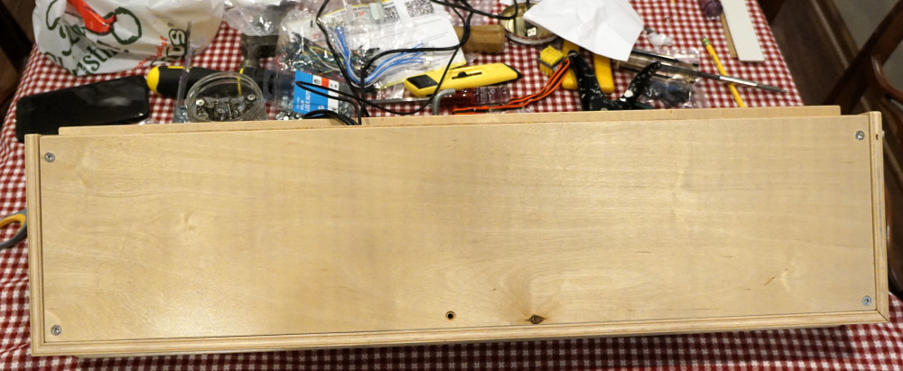

# Arcade Cocktail Table - Assembly of controllers

## Build 1 player controllers

Glue sides to top with biscuit joints.

Glue wood corner blocks using subfloor adhesive. In hindsight the glue didn't
adhere real well to the precoated plywood.  It's just good enough to work for
now, but I should have sanded the plywood first for better adhesion.  I may
replace these glued blocks with something better in the future.

Print joystick / button pattern 1:1 scale on paper and align on controller box.

Drill pilot holes using small bit.

Drill partway from the back with spade bit to avoid splintering when drilling
with spade bit from top side.

Completed the hole drilling.  There was some small splintering near some of the
edges of the holes, but fortunately the plastic lip on the buttons and joystick
plate covers any blemishes.

The button assembly and wiring is covered in the 2 player controller summary
below.

## Build 2 player controller

The box is assembled identically to the 1 player version, just at a different
scale.

With bottom cover in place.

Print pattern for trackball and align on the inside of the controller box.

Drill holes for trackball plate and cut out opening with jigsaw.

Started drilling pilot holes for buttons and realized they weren't quite where
I wanted them to be!  Fortunately they were within the radius of the spade bit
in the updated position and as such were discarded with no harm.

Re-aligned pattern and drilled new pilot holes.

Partway through drilling all button / joystick holes.  You can see the original
misplaced pilot holes in the lower right of this picture.

Start mounting joystick plates.

Mount trackball.

Finished mounting all joysticks and buttons.

Start wiring buttons.  Also wire Optiwiz controller for trackball.

Mount Optiwiz to underside of controller box.

Finish wiring rest of buttons and joysticks.  Also run USB cables and mount
securement loop prior to open through hole in back.

Attach bottom cover of box.

[Return to Main Page](README.md)
