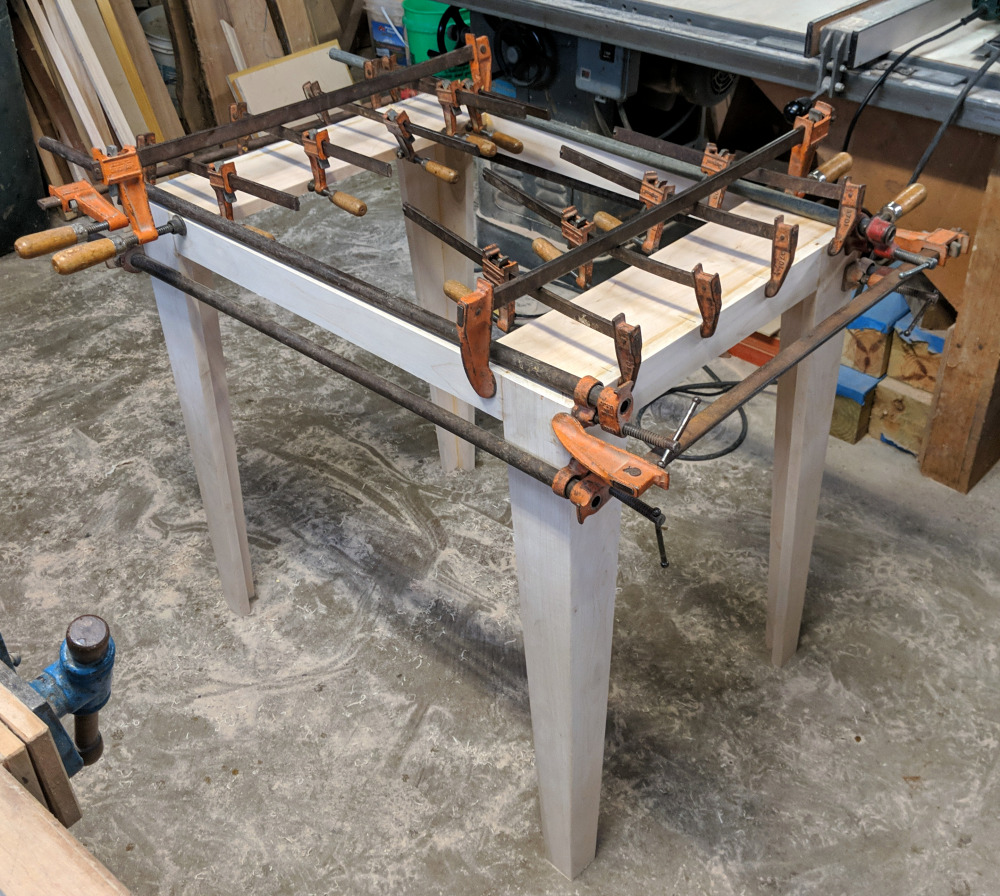
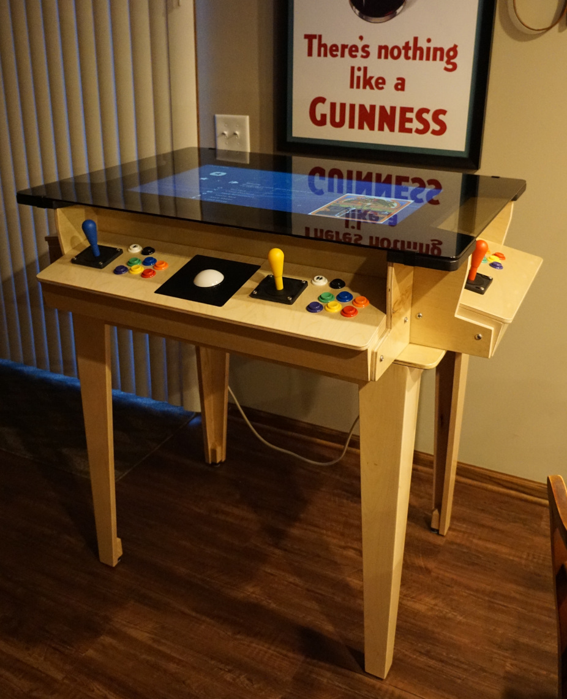
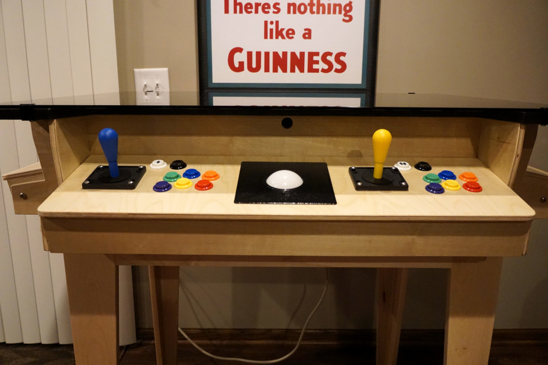
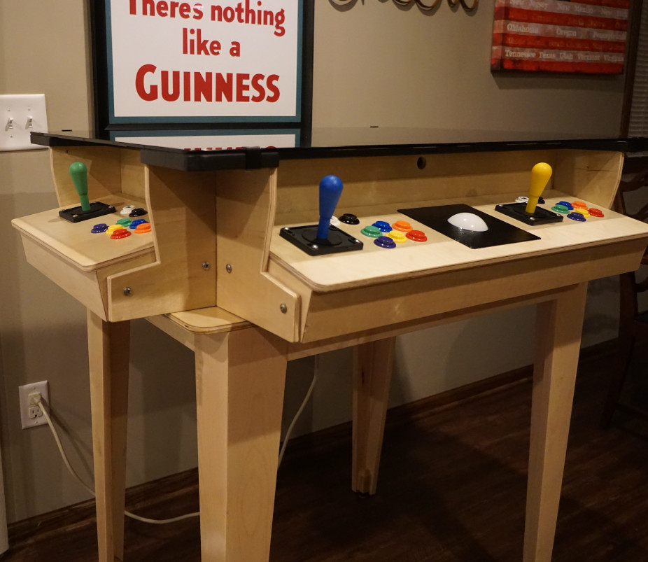
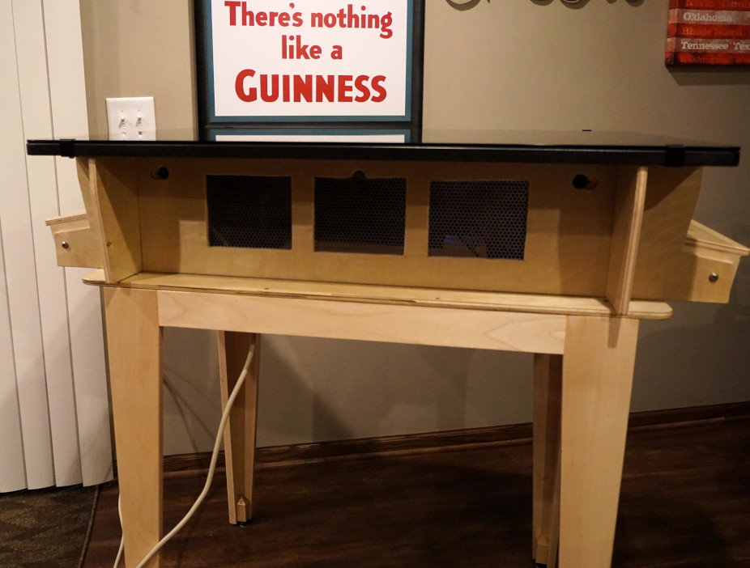

# Arcade Cocktail Table - Final Assembly and Completed System

I brainstormed and drafted a few different table leg / support options to
run by my wife and ultimately landed on the design shown on the main page.
I selected clear Maple for the legs which is not the same as the wood skin
on the plywood (birch if I recall right), however it still matches quite
well and brings along the reliable strength and durability that comes with
Maple.

Below is an image of the table legs being clamped.  Biscuits were also used
here to glue the joints together.  It's proven to be quite strong and stable.

I mounted small blocks to the inside corners at the bottom of the legs so that
I could attach the furniture levelers to the bottom.  You can see them to
some extent in the finished pictures below.

Next, sanding sealer and clear polyurethane (both water based) were applied to
the legs and base plate and it turned out quite well. Throughout all of this I
used water based paints and coatings out of necessity. The painting was
happening in my finished basement with tarps down because it was winter and the
temps were well below the acceptable range on the labels.  These water based
coatings did not smell as much and in addition it was much easier to clean up
brushes etc. in the utility sink with water.  Overall I was pleasantly
surprised how far along water based products have come.

Below is the finished product. I didn't detail the internal wiring as it was
fairly straightforward.  Monitor, usb-hub, speakers, etc. were all connected to
the laptop, and all were plugged into a power strip mounted on the inside.
[Lakka](https://www.lakka.tv) was installed on the laptop and it was easy to
set up and worked quite well.  Many settings were easily tweaked and updated
to my satisfaction using the joysticks and buttons.

For the backside of the cabinet I wanted to create ventilation openings to try
and keep things cooler within the cabinet (see below).  I used perforated metal
to allow air circulation while also preventing others from reaching in.  I also
used perforated metal on the bottom side of the cabinet, and the combination of
the two has kept things sufficiently cool without the need for active fans etc.
If you look closely you can see three drill holes (one of those half a drill
hole) that I originally thought I would need, but in hindsight were not needed.
Fortunately they are mostly out of sight. 

[Return to Main Page](README.md)
