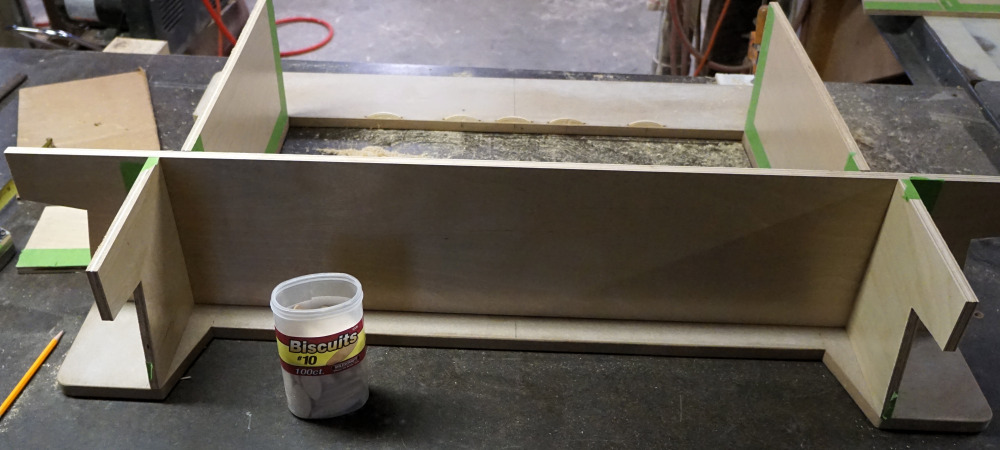

# Arcade Cocktail Table - Assembly of frame

## Cutout top and sand

MDF (medium density fiberboard) was used for the top due to its smooth surface
and uniformity.

Scribe the basic shape for the top in pencil.

Drill holes for jigsaw blade and cut center display opening.

The completed jigsaw cut.

Sand top to smooth edges and round corners.

## Apply sanding sealer, cut biscuit slots, and dry fit parts

Apply sanding sealer.  MDF soaks up a **lot** of finish, so the sanding sealer
is very helpful to lock the pores.  I think I ended up applying three coats of
sanding sealer until it stopped soaking up the finish.

Cut biscuit slots.

Start dry fitting parts to make sure things will align.

More dry fitting of parts.

Double check that the display still fits in the top.  Note that the display
stand is removable and was taken off later.

## Paint the top

Start painting top side with flat black latex paint.

Complete painting top side.  Note that when it is wet it looks very streaked
and non uniform.  This goes away when it dries and I was very glad I chose flat
paint.

After it dries, flip painted top over and dry fit supports again so that lines
can be traced to mark the edges of the supports.

Apply painters masking tape to all the edges where the joints will be glued.  I
found it easiest to place one edge of the tape down, then apply the other edge
down and pinch the excess tape in the middle.

Paint the underside of the top with flat black.

Remove masking tape after it dries.

## Glue the supports to the top

Glue the short top supports in place.

Glue the long top supports in place.

Glue the back supports in place.

Glue the 2 player controller supports in place.

The glued up top assembly.

[Return to Main Page](README.md)
