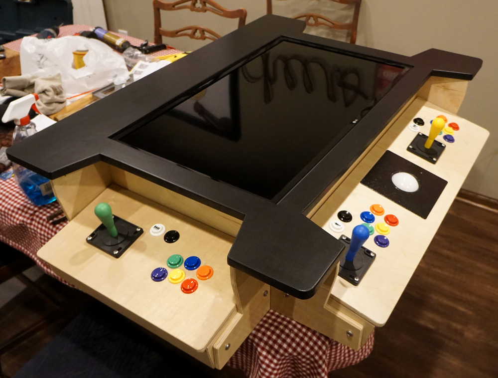
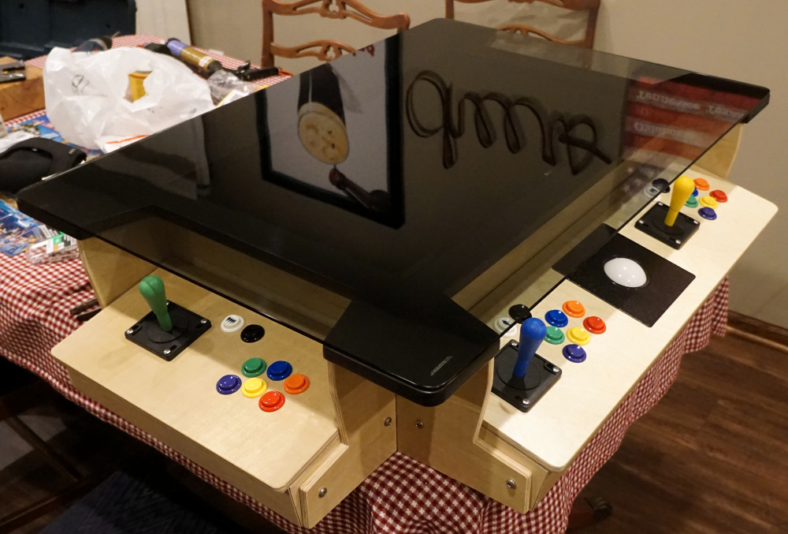
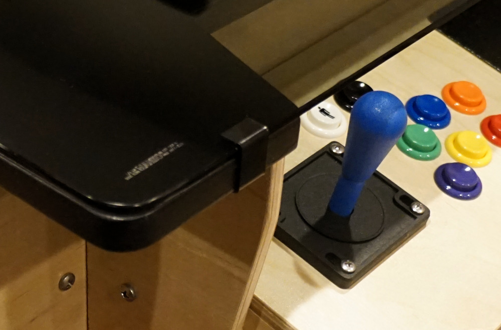
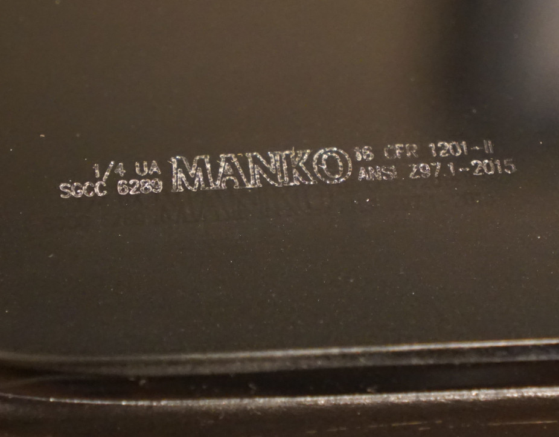

# Arcade Cocktail Table - Assembly of the System

Attach the controllers to the frame.  Note that there are four large stainless
machine screws used to mount each controller.  A lock nut on the inside of the
controller is used to hold the machine screws in place.  The heads of four of
these screws can be seen in the bottom of the photo below.

The screws hold the controllers in the right position and correct angle.  A
minor issue with this mounting method is that the bottoms of the controller
boxes need to be off to attach these to the frame.  After the machine screws
are installed then the bottoms of the controller boxes can be attached.  In
the future I may put some permanently mounted t-nuts on the inside of the
controller boxes so that the machine screws can just be threaded in from the
outside and a wrench will not be needed on the inside to hold the nut from
spinning.

I should have taken pictures of the monitor mounting method but I didn't so a
written description will have to do.  The monitor is held in place by gravity.
It is not attached to the frame.  There are small blocks or sticks under the
backside perimeter of the monitor that support it and hold it to be near flush
with the top of the black frame.  These sticks are attached to the plywood
sides on the inside with screws.  Overall this mounting method turned out to
work quite well.

Placing glass top on top of the frame / monitor.

Close up of the arcade glass clip holding the glass to the top.  I wasn't sure
if I would need more than four clips, but four holds it very securely in my
experience.

Here's a close up of the glass branding mark in the lower left corner.  It
highlights the manufacturer (Manko), the thickness (1/4"), and the fact that it
is tempered safety glass among other things.

[Return to Main Page](README.md)
